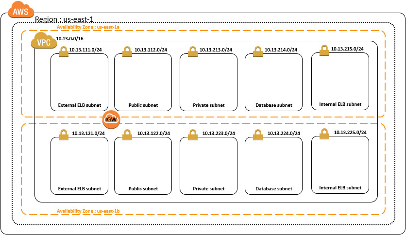

# AWS-CloudFormation-VPC
AWS CloudFormation for VPC

 

# Supported Region

<table>
    <tr>
        <td>Region</td>
        <td>Region Name</td>
        <td>VPC CIDR</td>
    </tr>

    <tr>
        <td>us-east-1</td>
        <td>US East (N. Virginia)</td>
        <td>10.13.0.0/16</td>
    </tr>
    
    <tr>
        <td>us-west-1</td>
        <td>US West (N. California)</td>
        <td>10.23.0.0/16</td>
    </tr>
    
    <tr>
        <td>us-west-2</td>
        <td>US West (Oregon)</td>
        <td>10.33.0.0/16</td>
    </tr>
    
    <tr>
        <td>eu-west-1</td>
        <td>EU (Ireland)</td>
        <td>10.43.0.0/16</td>
    </tr>
    
    <tr>
        <td>eu-central-1</td>
        <td>EU (Frankfurt)</td>
        <td>10.53.0.0/16</td>
    </tr>
    
    <tr>
        <td>ap-southeast-1</td>
        <td>Asia Pacific (Singapore)</td>
        <td>10.63.0.0/16</td>
    </tr>
    
    <tr>
        <td>ap-southeast-2</td>
        <td>Asia Pacific (Sydney)</td>
        <td>10.73.0.0/16</td>
    </tr>
    
    <tr>
        <td>ap-northeast-1</td>
        <td>Asia Pacific (Tokyo)</td>
        <td>10.83.0.0/16</td>
    </tr>
    
    <tr>
        <td>sa-east-1</td>
        <td>South America (Sao Paulo)</td>
        <td>10.93.0.0/16</td>
    </tr>
</table>
 
 
 

# Using Resource
+ 1 * VPC
+ 5 * Subnets : ExternalELB / Public / Private / DB / InternalELB
+ 1 * Internet Gateway
+ 2 * Availability Zone for each Regions 

 
 
 

## IP Address Digit

<table>
	<tr>
		<td colspan=3>A-Class</td>
		<td colspan=3>B-Class</td>
		<td colspan=3>C-Class</td>
		<td>D-Class</td>
	</tr>
	<tr>
		<td>N/A</td>
		<td>1(fixed)</td>
		<td>0(fixed)</td>
		<td colspan=2>Region</td>
		<td>Biz Svc</td>
		<td>Pub/Pri</td>
		<td>AZ</td>
		<td>Subnet</td>
		<td>0</td>
	<tr>
	
</table>	
	

# Assigning IP-Addresses (ex. us-east-1)

<table>
    <tr>
        <td> </td> 
        <td>us-east-1</td>
    </tr>
    <tr>
        <td>VPC</td>
        <td>10.13.0.0/16</td>
    </tr>
    <tr>
        <td>ExELB1</td>
        <td>10.13.111.0/24</td>
    </tr>
    <tr>
        <td>ExELB2</td>
	<td>10.13.121.0/24</td>
    </tr>
    <tr>
        <td>Public1</td>
	<td>10.13.112.0/24</td>
    </tr>
    <tr>
        <td>Public2</td>
	<td>10.13.122.0/24</td>
    </tr>
    <tr>
        <td>Private1</td>
	<td>10.13.213.0/24</td>
    </tr>
    <tr>
        <td>Private2</td>
	<td>10.13.223.0/24</td>
    </tr>
    <tr>
        <td>Database1</td>
	<td>10.13.214.0/24</td>
    </tr>
    <tr>
        <td>Database2</td>
	<td>10.13.224.0/24</td>
    </tr>
    <tr>
        <td>InELB1</td>
	<td>10.13.215.0/24</td>
    </tr>
    <tr>
        <td>InELB2</td>
	<td>10.13.225.0/24</td>
    </tr>

</table>
